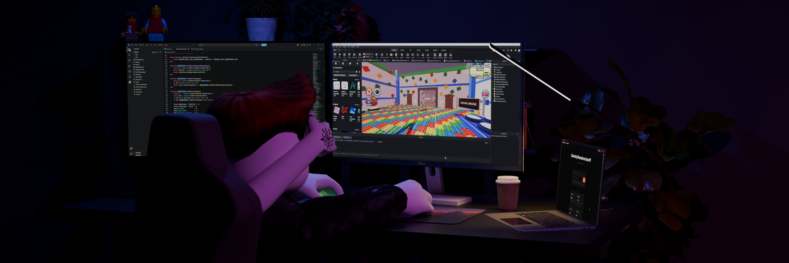
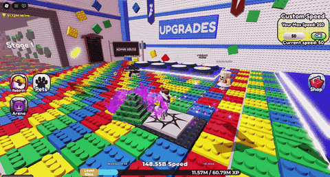
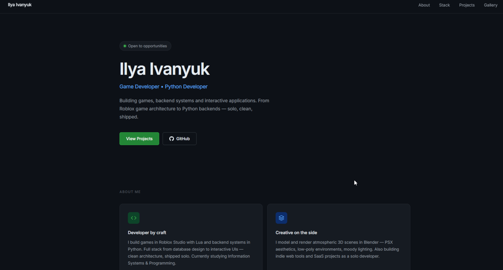
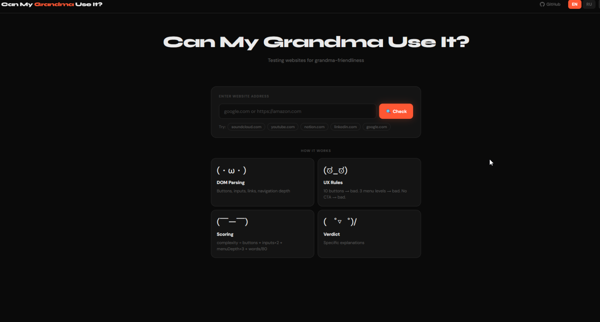
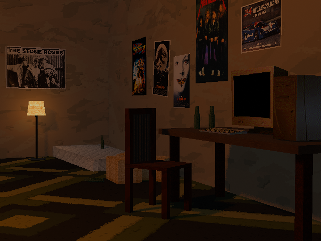
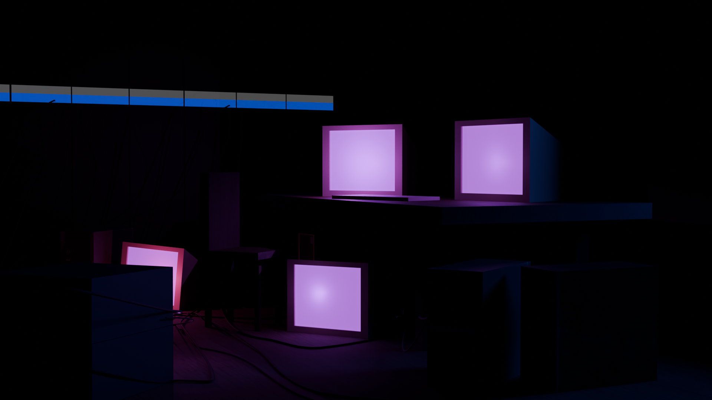

  

# Hi, I'm Ilya 👋
Game Developer | Python Developer

I'm a software developer passionate about game development, backend engineering, and building interactive applications.

Currently looking for opportunities in Game Development and Python Backend Development, with the goal of working in Japan.

---

## 🚀 About Me
- 🎮 Developing complete Roblox games from scratch
- 🐍 Building applications with Python
- 🌐 Interested in Backend and Web Development
- 🐧 Daily Linux user (Arch Linux)
- 🎨 Creating 3D assets in Blender
- 📚 Currently improving my English and Japanese

---

# 🛠 Tech Stack

### Languages

### Tools

---

# ⭐️ Featured Projects

## 🎮 Brick Speed Run
A multiplayer Roblox game built from scratch.

### Features
- Player progression system
- Experience & leveling
- DataStore persistence
- Speed progression
- Upgrade system
- 1v1 arena with invitations
- Pet system
- Multiple unique stages
- Modular architecture

---

## 🌐 Personal Website
Modern responsive website built for showcasing projects and development work.

Link: https://ethtoolq.github.io/#gallery

---

## 🐍 Grandma Checker
Python application demonstrating backend logic, automation and clean project structure.

Link: [www.grandmascore.site](https://www.grandmascore.site) or https://github.com/ethtoolq/grandma-checker

---

# 🌍 Languages
- 🇷🇺 Russian — Native
- 🇬🇧 English — B2
- 🇯🇵 Japanese — JLPT N4 (currently studying)

---

# 🎨 Blender

  
  
  

---

# 📈 GitHub Stats

---

# 📫 Contact
📧 Email: ilya.ivanyuk22@gmail.com
🐙 GitHub: https://github.com/ethtoolq
🌐 Portfolio: https://ethtoolq.github.io/#projects
💼 LinkedIn: https://linkedin.com/ethtoolq

---

> *"Always building, always learning."*
